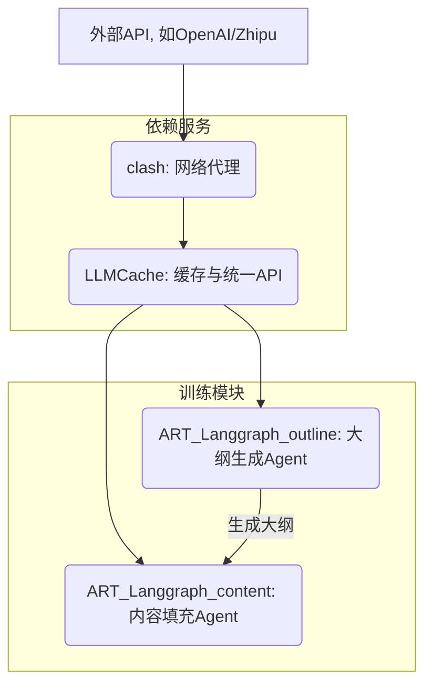

# Backend 目录说明

本目录包含了 `RLTrainPPT` 项目的所有后端服务和核心训练模块。这些组件协同工作，实现了从接收一个主题到最终生成完整PPT内容（以JSON格式表示）的完整流程。

## 组件概览

1.  **[Clash代理 (`clash/`)](./clash/)**: 
    -   **用途**: 提供一个基础网络代理服务，主要用于在受限网络环境（如国内）中访问外部API，例如 Google Gemini 或 OpenAI。
    -   **角色**: 它是整个服务能够连接外部世界的底层依赖，尤其对于`LLMCache`访问某些模型至关重要。

2.  **[LLM缓存与代理 (`LLMCache/`)](./LLMCache/)**:
    -   **用途**: 一个关键的中间件服务，它接收所有来自上层智能体（Agent）的大语言模型（LLM）请求。
    -   **核心功能**:
        -   **统一接口**: 为不同的LLM（如Qwen, GPT-4, O3等）提供一个统一的、兼容OpenAI的API端点 (`/chat/completions`)。
        -   **请求缓存**: 将LLM的请求和响应缓存到本地文件，避免重复请求，极大节约了API调用成本并加速了开发和调试。
        -   **失败回退**: 当一个模型请求失败多次后，能自动切换到备用模型，增强了训练的稳定性。

3.  **[PPT大纲生成Agent (`ART_Langgraph_outline/`)](./ART_Langgraph_outline/)**:
    -   **用途**: 训练一个专门负责生成PPT大纲的智能体。
    -   **工作模式**: 接收一个简单的**主题**（Topic），通过强化学习（ART + LangGraph）训练模型进行多轮网络搜索，分析和组织信息，最终生成一个结构化的、内容丰富的Markdown格式大纲。

4.  **[PPT内容填充Agent (`ART_Langgraph_content/`)](./ART_Langgraph_content/)**:
    -   **用途**: 训练一个负责为已有大纲填充详细内容的智能体。
    -   **工作模式**: 接收一个结构化的**JSON大纲**（可以由`ART_Langgraph_outline`生成的大纲转化而来），遍历大纲中的每一个要点，通过网络搜索查找资料，生成详细的文本描述，并附上引用来源，最终输出一个内容详实的完整JSON。

## 工作流程与依赖关系

各个组件的协作流程如下：

1.  **启动顺序**: 为了让训练顺利进行，应首先启动依赖服务。
    -   首先，运行 `clash` 服务来确保网络通畅。
    -   然后，运行 `LLMCache` 服务，它将作为所有LLM请求的入口。
2.  **训练流程**:
    -   运行 `ART_Langgraph_outline` 中的 `train.py` 来训练一个能根据主题生成大纲的模型。
    -   运行 `ART_Langgraph_content` 中的 `train.py` 来训练一个能根据大纲填充内容的模型。

详细的启动和训练指南请参考每个组件目录下的 `README.md` 文件。
